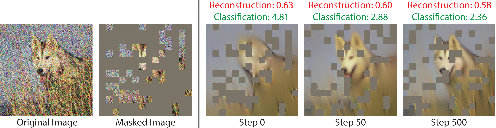

## Test-Time Training with Masked Autoencoders<br><sub>Official PyTorch Implementation</sub>

### [Paper](https://arxiv.org/abs/2209.07522) | [Project Page](https://yossigandelsman.github.io/ttt_mae/index.html)

[Yossi Gandelsman*](https://yossigandelsman.github.io/), [Yu Sun*](https://yueatsprograms.github.io/), [Xinlei Chen](https://xinleic.xyz/) and [Alexei A. Efros](https://people.eecs.berkeley.edu/~efros/)



### Setup
We provide an [`environment.yml`](environment.yml) file that can be used to create a Conda environment:

```bash
conda env create -f environment.yml
conda activate ttt
```

### Training MAE
To train a model on the main task, please use the code base from [Masked Autoencoders Are Scalable Vision Learners](https://github.com/facebookresearch/mae).
We provided a self-contained code for training here as well. Please run:

```bash
TIME=$(date +%s%3N)
DATA_PATH='...'
OUTPUT_DIR='...'
python -m torch.distributed.launch --nproc_per_node=8 main_pretrain.py \
        --data_path ${DATA_PATH} \
        --model mae_vit_large_patch16 \
        --input_size 224 \
        --batch_size 64 \
        --mask_ratio 0.75 \
        --warmup_epochs 40 \
        --epochs 800 \
        --blr 1e-3 \
        --save_ckpt_freq 100 \
        --output_dir ${OUTPUT_DIR}  \
        --dist_url "file://$OUTPUT_DIR/$TIME"
```

Alternatively, you can use a pretrained large VIT model from [here](https://dl.fbaipublicfiles.com/mae/pretrain/mae_pretrain_vit_large_full.pth):

```bash
mkdir checkpoints
cd checkpoints
wget https://dl.fbaipublicfiles.com/mae/pretrain/mae_pretrain_vit_large_full.pth
```

### Training the classification head
To train the classification head, run this:
```bash
TIME=$(date +%s%3N)
DATA_PATH='...'
OUTPUT_DIR='...'
RESUME_MODEL='checkpoints/mae_pretrain_vit_large_full.pth'
python -m torch.distributed.launch --nproc_per_node=8 main_prob.py \
        --batch_size 32 \
        --accum_iter 4 \
        --model mae_vit_large_patch16 \
        --finetune ${RESUME_MODEL} \
        --epochs 20 \
        --input_size 224 \
        --head_type vit_head \
        --blr 1e-3 \
        --norm_pix_loss \
        --weight_decay 0.2 \
        --dist_eval --data_path ${DATA_PATH} --output_dir ${OUTPUT_DIR}
```
Alternatively, you can use a pretrained model (with slightly different parameters) from [here](https://dl.fbaipublicfiles.com/mae/ttt/prob_lr1e-3_wd.2_blk12_ep20.pth):

```bash
mkdir checkpoints
cd checkpoints
wget https://dl.fbaipublicfiles.com/mae/ttt/prob_lr1e-3_wd.2_blk12_ep20.pth
```

### Test-time training

To train the model, you will first need to download the `imagenet-c` dataset, from [here](https://zenodo.org/record/2235448#.Yz9OHezMKFw).

After extracting the dataset, you can run test-time training on each of the test sets:

```bash
DATA_PATH_BASE='path_to_imagenet-c'
DATASET='gaussian_noise'
LEVEL='5'
RESUME_MODEL='checkpoints/mae_pretrain_vit_large_full.pth'
RESUME_FINETUNE='checkpoints/prob_lr1e-3_wd.2_blk12_ep20.pth'
OUTPUT_DIR_BASE='...'

python main_test_time_training.py \
    --data_path "$DATA_PATH_BASE/$DATASET/$LEVEL" \
    --model mae_vit_large_patch16 \
    --input_size 224 \
    --batch_size 128 \
    --steps_per_example 20 \
    --mask_ratio 0.75 \
    --blr 1e-2 \
    --norm_pix_loss \
    --optimizer_type 'sgd' \
    --classifier_depth 12 \
    --head_type "vit_head" \
    --single_crop \
    --dataset_name "imagenet_c" \
    --output_dir "$OUTPUT_DIR_BASE/$DATASET/" \
    --dist_url "file://$OUTPUT_DIR_BASE/$TIME" \
    --finetune_mode 'encoder' \
    --resume_model ${RESUME_MODEL} \
    --resume_finetune ${RESUME_FINETUNE}
```

### Baseline evaluation
To evaluate the model without applying test-time training, run:
```bash
DATA_PATH_BASE='path_to_imagenet-c'
DATASET='gaussian_noise'
LEVEL='5'
RESUME_MODEL='checkpoints/mae_pretrain_vit_large_full.pth'
RESUME_FINETUNE='checkpoints/prob_lr1e-3_wd.2_blk12_ep20.pth'
OUTPUT_DIR_BASE='...'
python test_without_adaptation.py \
        --data_path "$DATA_PATH_BASE/$DATASET/$LEVEL" \
        --model mae_vit_large_patch16 \
        --input_size 224 \
        --resume_model ${RESUME_MODEL} \
        --resume_finetune ${RESUME_FINETUNE} \
        --output_dir "$OUTPUT_DIR_BASE/$DATASET/baseline" \
        --classifier_depth 12 \
        --head_type "vit_head" 
```

### BibTeX

```bibtex
@inproceedings{
        gandelsman2022testtime,
        title={Test-Time Training with Masked Autoencoders},
        author={Yossi Gandelsman and Yu Sun and Xinlei Chen and Alexei A Efros},
        booktitle={Advances in Neural Information Processing Systems},
        editor={Alice H. Oh and Alekh Agarwal and Danielle Belgrave and Kyunghyun Cho},
        year={2022},
        url={https://openreview.net/forum?id=SHMi1b7sjXk}
}
```
